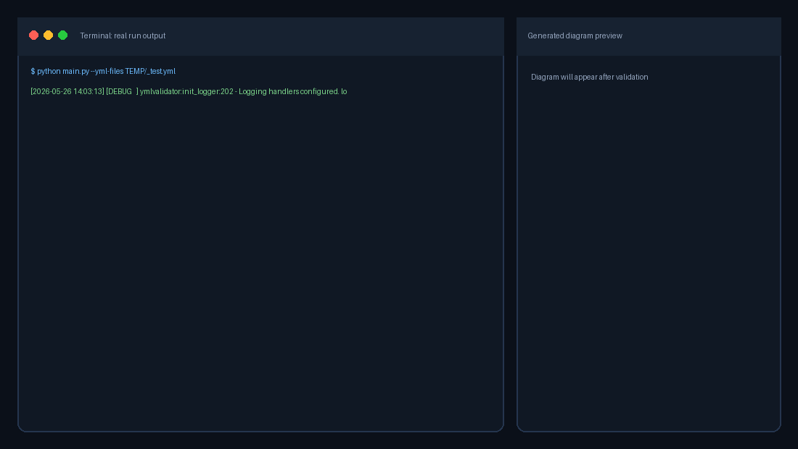
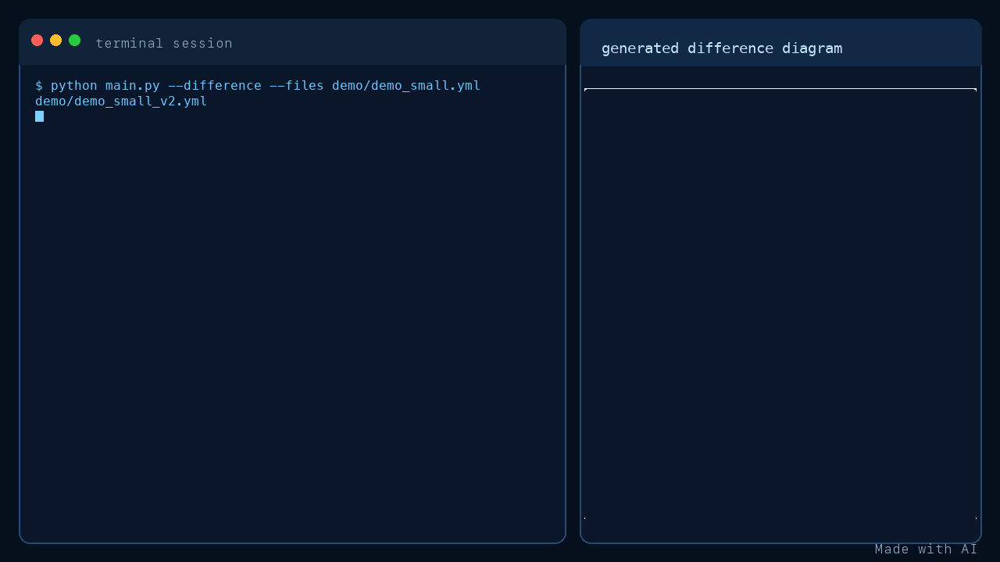

# flowguard

[](https://github.com/LacaluD/flowguard/actions/workflows/main.yml)
[](https://codecov.io/gh/LacaluD/flowguard)
[](LICENSE)

## flowguard is a CLI tool for configuration validation and structure visualization.

### It helps teams:
- validate YAML, JSON, and TOML config files in CI with predictable exit codes,
- enforce required and optional checks via yq expressions,
- validate against JSON Schema,
- generate visual graphs from YAML configs and config diffs.

### See [CHANGELOG.md](docs/CHANGELOG.md) for release history.

## What flowguard does

flowguard is designed for repositories where configuration quality directly impacts delivery reliability.
It combines three layers of protection in one command:

1. Syntax and structural validation:
Checks YAML syntax and required fields with yq expressions, plus optional consistency checks.

2. Contract validation:
Validates files against JSON Schema to enforce domain rules and catch incompatible config changes early.

3. Visualization:
Builds graph outputs from YAML configs and from config-to-config diffs to simplify review and debugging.

### In practice, flowguard is useful as:
- a pre-commit or pre-push local validator,
- a CI quality gate for pull requests,
- a troubleshooting helper when changing workflows, pipelines, or deployment manifests.

### Key operational behavior:
- deterministic exit codes (0 success, 1 failure),
- `--quiet` mode for cleaner CI logs,
- separation of warning/error output and regular output,
- automatic external binary discovery with optional recursive fallback in custom directories,
- optional directory exclusions for broad repository scans via `--exclude-dir`.

### **Standart run**



### Difference demo



## Core capabilities

- Validate one file or recursively process a directory (YAML, JSON, TOML)
- Run required and optional yq checks over YAML structure
- Detect deprecated GitHub Actions references
- Validate indentation and whitespace issues
- Validate YAML, JSON, and TOML against JSON Schema
- Build diagrams from YAML via yml2dot and Graphviz
- Build config difference graphs in svg, png, or dot format
- Discover external binaries automatically, with optional recursive search in custom folder

## Requirements

Python:
- Python 3.10+
- PyYAML
- jsonschema
- loguru

External tools:
- yq
- yml2dot
- Graphviz dot

## Installation

### 1. Clone repository

```bash
git clone https://github.com/LacaluD/flowguard.git
cd flowguard
```

### 2. Create virtual environment

macOS/Linux:

```bash
python3 -m venv .venv
source .venv/bin/activate
```

Windows PowerShell:

```powershell
py -m venv .venv
.\.venv\Scripts\Activate.ps1
```

### 3. Install Python dependencies

```bash
pip install -r requirements.txt
# or
pip install ".[dev]"
```

### 4. Install external binaries

macOS (Homebrew):

```bash
brew install yq graphviz
# install yml2dot from release page and add it to PATH
```

Ubuntu/Debian:

```bash
sudo apt update
sudo apt install -y yq graphviz
# install yml2dot from release page and add it to PATH
```

Windows:
- Install yq
- Install Graphviz
- Install yml2dot
- Ensure yq, yml2dot, dot are available in PATH

Quick check:

```bash
command -v yq
command -v yml2dot
command -v dot
```

## CLI usage

Basic validation:

```bash
python main.py --files demo/yml_demo_small_v2.yml

# JSON and TOML are also supported in regular mode
python main.py --files demo/json_demo_small_v2.json
python main.py --files demo/toml_demo_small_v2.toml
```

Directory validation:

```bash
python main.py --files .
```

Validation with recursive binary fallback directory:

```bash
python main.py --files . --exec-dir "$PWD"
```

Schema validation pipeline:

```bash
python main.py --files schema_docs/schema_example_valid.yml --schema schema_docs/schema_example.json
```

Exclude generated or local environment directories from a broad scan:

```bash
python main.py --files . --exclude-dir .venv .git node_modules
```

Disable optional checks:

```bash
python main.py --files demo/yml_demo_small_v2.yml --no-optional-checks
```

Difference visualization:

```bash
python main.py --files demo/yml_demo_small_v1.yml demo/yml_demo_small_v2.yml --difference --output-format svg

# render difference only for one job key
python main.py --files .github/workflows/main.yml .github/workflows/main.yml --difference --job tests --output-format svg
```

Per-job visualization for regular pipeline:

```bash
python main.py --files .github/workflows/main.yml --job tests
```

Quiet mode:

```bash
python main.py --quiet --files demo/yml_demo_small_v2.yml
```

Help commands:

```bash
python main.py --list-checks
python main.py --description
python main.py --version
```

## Exit codes

- 0: success
- 1: validation or runtime failure

This behavior is designed for CI-friendly pipeline integration.

## Docker

### Build

```bash
docker build -t flowguard .
```

### Usage

Mount your config files into the container and pass the path inside:

```bash
# Validate a single file
docker run --rm -v $(pwd):/data flowguard --files /data/ci.yml

# Validate with schema
docker run --rm -v $(pwd):/data flowguard --files /data/ci.yml --schema /data/schema.json

# Diff two configs
docker run --rm -v $(pwd):/data flowguard --files /data/ci_v1.yml /data/ci_v2.yml --difference

# Per-job visualization
docker run --rm -v $(pwd):/data flowguard --files /data/ci.yml --job deploy
```

### Requirements

No local dependencies required — graphviz, yq, and yml2dot are bundled in the image.

## Logging

### flowguard uses loguru with three sinks:
- stderr for warning and error logs
- stdout for debug/info/success logs
- rotating file logs in logs/main.log (configurable)

### Environment variables:
- LOG_LEVEL
- LOG_FILE_LEVEL
- EXTERNAL_LOG_LEVEL
- LOG_DIR
- LOG_FILE_NAME

### Example:

```bash
export LOG_LEVEL=DEBUG
export LOG_FILE_LEVEL=INFO
export LOG_DIR=./logs
export LOG_FILE_NAME=validator.log
python main.py --files demo/yml_demo_small_v2.yml
```

## Schema guide

See [schema_docs/schema_guide.md](schema_docs/schema_guide.md) for writing and applying custom schemas.

## For contributors

See [docs/CONTRIBUTING.md](docs/CONTRIBUTING.md) developer documentation

## Testing

Run all tests:

```bash
python -m pytest -q -c configs/pytest.ini
```

### Current suite size:

### The repository currently keeps the full suite at 275 tests.

#### Run with coverage:

```bash
python -m coverage run -m pytest -q -c configs/pytest.ini
python -m coverage report --fail-under=90
```

#### Targeted module coverage checks:

```bash
python -m pytest -q -c configs/pytest.ini tests/test_validate_by_schema.py tests/test_yaml_corner_cases.py
python -m pytest -q -c configs/pytest.ini --cov=src.validation_by_schema --cov-report=term-missing tests/test_validate_by_schema.py tests/test_yaml_corner_cases.py
```

#### Run golden tests:

```bash
python -m pytest -q tests/test_golden.py -c configs/pytest.ini
```

#### Update golden baselines:

```bash
python -m pytest -q tests/test_golden.py -c configs/pytest.ini --update-golden
```

## Common errors

| Message | Typical cause | Fix |
|---|---|---|
| `'<path>' is neither a file nor directory` | Wrong --files path | Check path and rerun |
| `'<path>' does not exist` | Wrong --files path or typo in path | Check the path and rerun |
| `No config files found in '<path>'` | Empty folder or no supported config files | Point --files to a folder/file with .yml, .yaml, .json, or .toml |
| `job '<name>' not found under 'jobs'` | Wrong job name passed to --job | Check job names in your config file |
| `top-level 'jobs' mapping is missing` | Config has no jobs key | Ensure config has a top-level jobs mapping |
| Not all required executables were found | Missing yq, yml2dot, or dot | Install missing binaries or pass --exec-dir |
| Schema file does not exist: <path> | Wrong --schema path | Check schema path and rerun |
| regular validation requires exactly one config file, got N | Multiple paths passed to --files in regular mode | Pass one file/folder to --files or use --difference for two files |
| Wrong file format! Both files must be .yml, .yaml, .json, or .toml | Unsupported extension in difference mode | Use supported formats for both input files |

## Project layout

```text
flowguard
├─ main.py
├─ requirements.txt
├─ pyproject.toml
├─ version.py
├─ LICENSE
├─ src/
│  ├─ cli_parser.py
│  ├─ constants.py
│  ├─ logger.py
│  ├─ main_validation_logic.py
│  ├─ diff_visualizer.py
│  ├─ dot_schemas.py
│  ├─ validation_by_schema.py
│  ├─ platform_checks.py
│  └─ utils.py
├─ tests/
├─ configs/
├─ docs/
├─ demo/
├─ .github/workflows/
└─ schema_docs/
```

## Status

### Planned:

- Refactor and Optimize

### After release

- Enhanced per-job/section graph detail and dependency mapping
- YAML anchors, references, and nested relationship rendering
- Relationship-focused visualization